# Alexa to Run Systems Manager Documents 

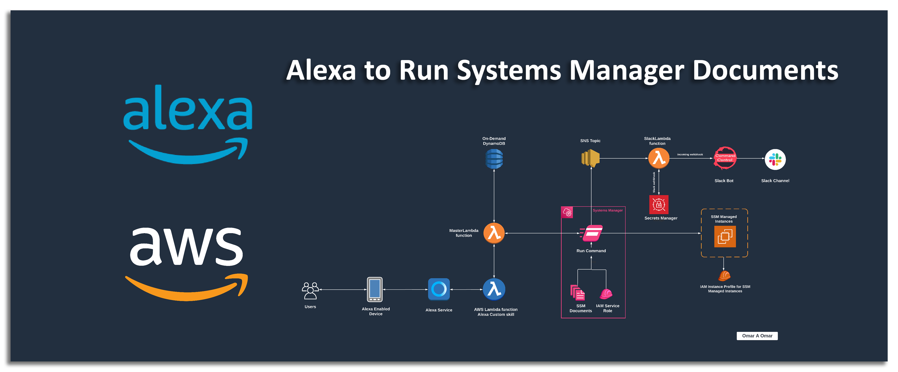


## Introduction:


Alexa is Amazon's cloud-based voice service that powers hundreds of millions of devices. It also enables developers to build [skills](https://developer.amazon.com/en-US/alexa/alexa-skills-kit), which are like applications for Alexa. The Alexa skill is a cloud-based solution that provides the logic and functionality to perform certain tasks using voice commands. The skill is hosted on AWS Lambda and is built using [Alexa Skills Kit](https://developer.amazon.com/en-US/docs/alexa/sdk/alexa-skills-kit-sdks.html) SDK (ASK) framework. The communication between [Alexa service](https://developer.amazon.com/en-US/docs/alexa/alexa-voice-service/get-started-with-alexa-voice-service.html) and the Lambda function hosting the Alexa skill is [encrypted](https://developer.amazon.com/en-US/docs/alexa/custom-skills/host-a-custom-skill-as-an-aws-lambda-function.html#:~:text=continuously%20run%20servers.-,Alexa%20encrypts,-its%20communications%20with) and the access permissions to the Lambda function are protected by AWS Identity and Access Management (IAM) policies. Therefore, we can be confident that Alexa skills are secure. 


This step-by-step tutorial walks you through the process of developing an Alexa cloud-based solution. We will build our Alexa skill using Alexa Skills Kit SDK (ASK) for Python that will allow us to run [AWS Systems Manager Documents](https://docs.aws.amazon.com/systems-manager/latest/userguide/sysman-ssm-docs.html) (SSM documents) using [Run Command](https://docs.aws.amazon.com/systems-manager/latest/userguide/execute-remote-commands.html), which is a capability of Systems Manager. The SSM documents run on AWS Systems Manager [managed nodes](https://docs.aws.amazon.com/systems-manager/latest/userguide/managed_instances.html) (SSM managed EC2 instances) using [AWS-RunDocument](https://docs.aws.amazon.com/systems-manager/latest/userguide/run-remote-documents.html). Utilizing the AWS-RunDocument SSM document with Run Command enables us to run any SSM document on our managed nodes without having to modify our backend source code (Python). It is a great way to standardize the process of running SSM documents on our managed nodes. The SSM documents define the actions to perform on the managed instances and can be used to perform a variety of tasks such as patching OS, stopping EC2 instances, installing software, updating software, configuring operating systems, and much more. Basically, sky is the limit when it comes to the functionality of running SSM documents.

It is worth mentioning that this serverless solution is built using AWS services and components with minimal costs associated. The solution is also built using the best practices and the least privilege principle. The access permissions to the AWS services and components are protected by AWS Identity and Access Management (IAM) policies. Therefore, we can be confident that our solution is secure.

The ultimate goal of the tutorial is to simplify the process of building this cloud-based solution, learning how to create an Alexa skill and learning how to create several AWS services and components such as, DynamoDB table, IAM service role, SNS topic, Lambda functions, Secrets Manager secret, and SSM documents. Moreover, it is a great opportunity to learn about the logic behind the solution and the architecture of the solution. 

As an AWS Community Builder, this is part of my continuous effort to share knowledge and experience with the community. The value added by this solution is to run SSM commands on our managed instances without having to log into the AWS console or to use the AWS CLI. We can perform tasks remotely and securely from anywhere using Alexa enabled devices such as an Echo device or Alexa mobile app. Run commands and tasks remotely on our managed instances using Alexa is a great way to save time and to automate the process of running SSM documents on our managed instances.
I intend keep the tutorial as simple as possible and will not go into the details unless necessary. I will pass the baton to you to take the solution to the next level. I will also intentionally intermingle between SSM documents and SSM commands. Although, the solution could be built using IaC, we would have lost the learning experience. 

Remember, the goal of the tutorial is to learn and to understand the logic and architecture of the solution. It's about the journey, not the destination, so let's buckle up and get started!

<br>

## Alexa Cloud Solution: Logic and Architecture:

The solution consists of several AWS services and components as shown on the diagram below. The logic flow might be a bit complex at first, but it becomes clearer as we go through the tutorial. 

1. The user wakes up the Alexa skill by saying, `Alexa, open {name of the skill}` on Alexa enabled devices such as an Echo device or Alexa mobile app. Our skill is called `Command Control`.
2. The user initiates a voice command to run an SSM command for a specific instance tag by saying, `{name of the command} {name of the tag}`, for example, `patch dev`. Ofcourse, we can change the utterances to match our needs. But for the purpose of this tutorial, we will keep it simple. 
3. The Alexa service sends a JSON body request to invoke the Lambda function hosting the Alexa skill (AlexaSkill function). The AlexaSkill Lambda function validates the request and extracts the command and tag from the request.
4. The AlexaSkill function sends a payload of the command and tag to the Master Lambda function. The Master Lambda function is invoked [synchronously](https://docs.aws.amazon.com/lambda/latest/dg/invocation-sync.html).
5. Based on the command and tag received, the Master Lambda function queries a DynamoDB table to obtain the SSM document name and any SSM document parameters corresponds to the command.

>Note: not all SSM documents require parameters. It's our responsibility to make sure that the SSM document name and any SSM document parameters are valid. The parameters in the DynamoDB table should be in JSON format.

6. The Master Lambda function validates the response from the DynamoDB table. If the response is not valid, the Master Lambda function returns error message to AlexaSkill function. The handled errors could be such as, the Command, SSM document name, any SSM document parameters or even the DynamoDB table name are not valid or don't exist.
7. The Master Lambda function then queries whether or not the specified tag exists for any **running** EC2 instances in the region (the instance will be ignored if it's not in the running status). If the condition is met (tag exists and the instance is running), the Master Lambda function then queries whether or not the instances are SSM managed nodes. Again, if this condition is met (the instances are SSM managed nodes), the Master Lambda function sends the `AWS-RunDocument` attributes to Run Command to run the SSM document on the EC2 instances. If the condition is not met, the Master Lambda function returns error message to AlexaSkill function. The handled errors could be such as, the specified tag does not exist for any running and SSM managed EC2 instances.

8. The Run Command runs the SSM document on the EC2 instances filtering by the specified tag. Once Run Command has started executing the SSM document on the EC2 instances successfully, the `Pending` status is to be returned to the Master Lambda function.
9. The Master Lambda function sends the `Pending` status, command, tag and number of instances the SSM document is running on back to AlexaSkill function and AlexaSkill function sends the response to the user.
10. The Run Command also sends notifications to the SNS topic to notify the user once the SSM document has been run on the EC2 instances and also when the status has been updated to `InProgress`, `Failed` or `Success`.

>Note: if you prefer to receive notifications via email, SMS, or any other method allowed by SNS, you can subscribe to the SNS topic. It's also worth noting that the Run Command records the status of the SSM document in the SSM document history. Therefore, we can always go to the Run Command history to see the status of the SSM document.


**Important Notes:**

- The Master Lambda function only runs SSM documents on running and SSM managed nodes. Therefore, if the EC2 instance is not running or not SSM managed, the Master Lambda function will ignore it.
- To create SSM managed nodes, we need to install the SSM agent on the EC2 instance. The SSM agent is installed by default on Amazon Linux 2 EC2 instances. However, if we are using other Linux distributions, we need to install the SSM agent manually. Then, we need to attach an instance profile IAM role with the `AmazonSSMManagedInstanceCore` policy to the EC2 instance. Please, refer to [AWS documentation](https://docs.aws.amazon.com/systems-manager/latest/userguide/systems-manager-setting-up-ec2.html) for more details on to setup SSM managed nodes.
- We also need to tag the EC2 instances with a key-value pair to filter the EC2 instances. I have designated `Alexa` to be the constant tag key, and we need to specify the tag value in the voice command to match the tag value we have specified for the EC2 instances. Therefore, if the instance does not have `Alexa` as the tag key, the Master Lambda function ignores the instance. If we need to use a different tag key, we should modify the `tag_key = 'Alexa` in the Master Lambda function Python source code.
- As best practices, I have configured intensive code level logging to cover lots of error scenarios, which should be helpful for troubleshooting and debugging. If an error is raised, the Master Lambda function sends an error message to AlexaSkill and eventually back to the user. The error messages are also logged in CloudWatch Logs for the Master Lambda function log group.

<br>

## Alexa Cloud-based Solution Architecture Diagram

<br>

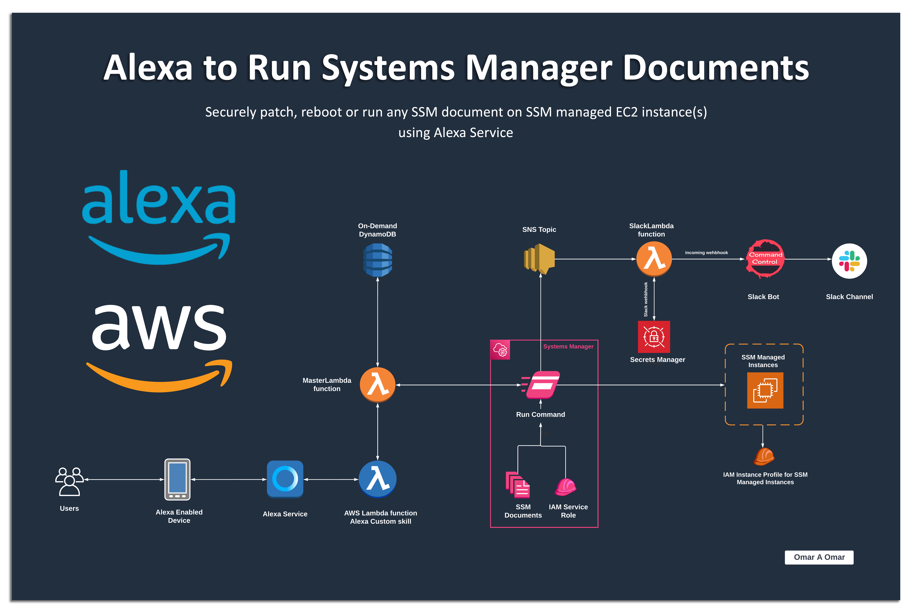

<br>

---

## Tutorial Sections:

The solution is broken down into several sections to make it easier to follow. The sections are as following:

1. Creating an Alexa skill hosted on AWS Lambda function (AlexaSkill function) using the Alexa Skill Kit (ASK) SDK for Python and Boto3 SDK for Python
2. Configuring the skill with Alexa service on Alexa Developer Console
3. Creating an SSM document to stop running EC2 instances. We will also use AWS SSM document `AWS-RunPatchBaseline` to patch Amazon Linux 2 EC2 instances. This covers the two scenarios; running AWS managed SSM documents and customer created SSM documents
4. Creating an SNS topic to publish notifications from Systems Manager - Run Command
5. Creating an IAM service role for Systems Manager to send notifications to the SNS topic
6. Provisioning an on-demand DynamoDB table to store the commands, SSM document names and any SSM document parameters that are used by the Master Lambda function
7. Creating a Lambda function (MasterLambda) to send SSM commands to Systems Manager - Run Command
8. Creating a Lambda function (SlackLambda) to send notifications to Slack or you may use any other method of your choice (optional)
9. Testing Alexa skill and Run Command
10. Party time 🎉🎉🎉


---

## Prerequisites:

1. An [AWS account](https://aws.amazon.com/)
2. An [AWS Alexa Developer account](https://developer.amazon.com/)
3. Python 3 (>= 3.6)
4. pip
5. virtualenv or venv
6. Alexa enabled device or Alexa app on your mobile device

---

## 1: Creating Alexa skill hosted on AWS Lambda function (AlexaSkill) 


#### Step 1: Setting up the ASK SDK in a virtual environment on Linux or macOS


1. Create a virtual environment:

```
virtualenv command_control
```

>Note: `commands` is the name of the virtual environment. You can use any name you want. Also for Windows, you may refer to [Alexa documentation](https://developer.amazon.com/en-US/docs/alexa/alexa-skills-kit-sdk-for-python/set-up-the-sdk.html#set-up-sdk-in-virtual-environment:~:text=Option%201%3A%20Set%20up%20the%20SDK%20in%20a%20virtual%20environment) for more details.

2. Activate the virtual environment:

```
source command_control/bin/activate
```

3. Install the ASK SDK:

```
pip install ask-sdk
```

>Note: The ASK SDK is installed in the virtual environment. You can use the `deactivate` command to exit the virtual environment.


#### Step 2: Add skill source code


Create a Python file named `lambda_function.py` in the `command_control` root directory and copy the Python code from this [Lambda](files/lambda_function.py) function.

>Note: it's important to name the file `lambda_function.py` because the Lambda function will be looking for this handler when it's invoked.


#### Step 3: Packaging and Creating Lambda Function (AlexaSkill function)

1. From the `command_control` root directory, copy the lambda_function.py into `lib/python3.8/site-packages/` directory.

```
cd command_control
```
```
cp lambda_function.py lib/python3.8/site-packages/
```


2. Navigate to the `site-packages` directory to create a zip file of the dependencies:

```
cd lib/python3.8/site-packages
zip -r lambda-package.zip .
```

>Note: There are multiple ways to create a zip file for the package. You can use any method you prefer or refer to [AWS documentation](https://docs.aws.amazon.com/lambda/latest/dg/python-package.html) for more information.


3. Navigate to AWS Lambda console and create a new function with the following settings:

* Function name: `AlexaSkill` or any name you prefer
* Runtime: Python 3.9
* Architecture: x86_64
* Role: Create a new role with basic Lambda permissions
* Click Create function

>Note: we will come back to add all necessary permissions to the lambda IAM role later.

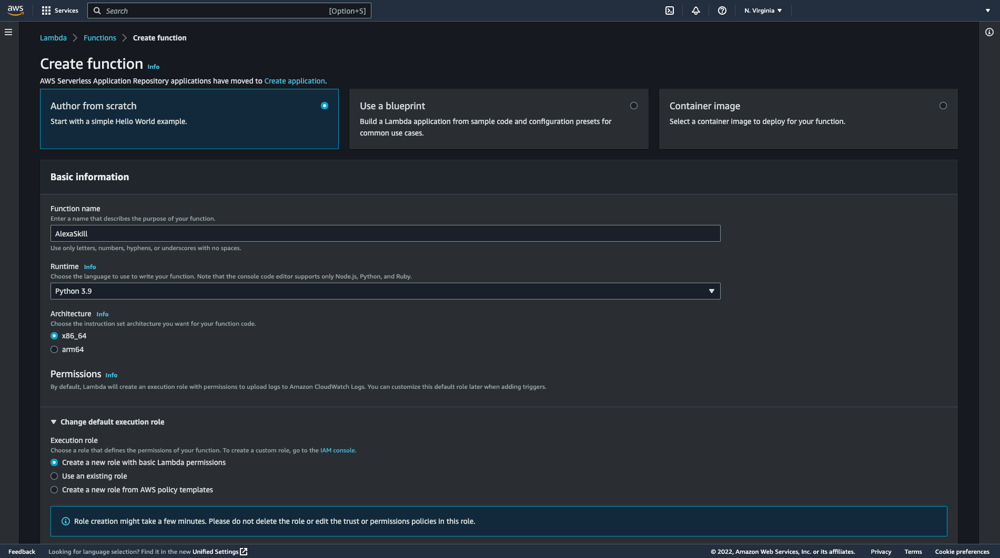

4. Upload the `lambda_package.zip` file to the Lambda function.

5. Copy the ARN of the Lambda function. We will need it later.

---

## 2: Configuring skill with Alexa service via the Alexa Developer Console

#### Step 1: Configuring Alexa service

1. Navigate to the [Alexa Developer Console](https://developer.amazon.com/alexa/console/ask) and login to create a skill.
2. Click on the `Create Skill` button.

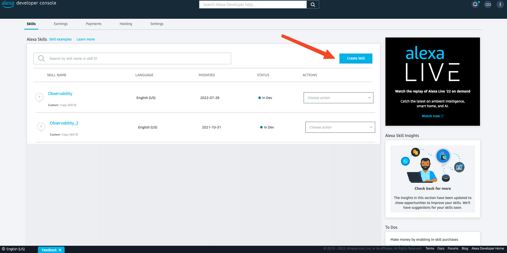

3. Name the skill `Command Control` and click `Next`.

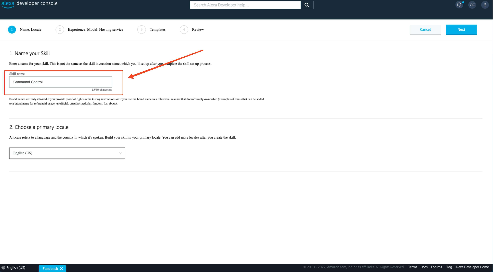

4. For `Experience, Model, Hosting service` page, select options as follows:

* `Other` for `Choose a type of experience`
* `Custom` for `Choose a model`
* `Provision your own` for `Hosting service`

Then, click on the `Next` button.

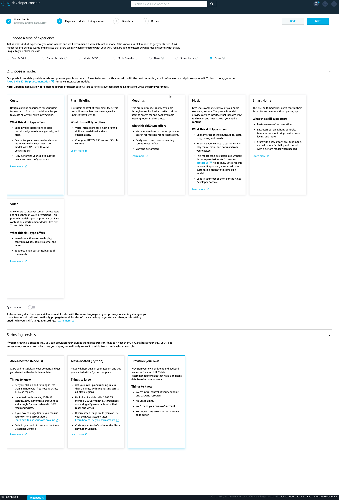

4. On `Templates` page, select the `Start from scratch` option and click on the `Next` button.
5. On `Review` page, click on the `Create Skill` button.

#### Step 2: Configuring skill with Alexa Service

1. Under `CUSTOM` section on the left hand side menu, click on `Interaction Model`. Then, click on `JSON Editor` tab. Copy the JSON text from this [interaction model](files/interaction-model.json) file and paste it into the JSON editor. Then, click on the `Save Model` button followed by the `Build Model` button.

>Note: the JSON text is the interaction model for the skill. It's a quicker way to define the intents and utterances for the skill instead of doing it manually. To learn more about the interaction model, refer to [Alexa documentation](https://developer.amazon.com/en-US/docs/alexa/custom-skills/create-the-interaction-model-for-your-skill.html). Also, ensure that you have not received any errors while building the model.

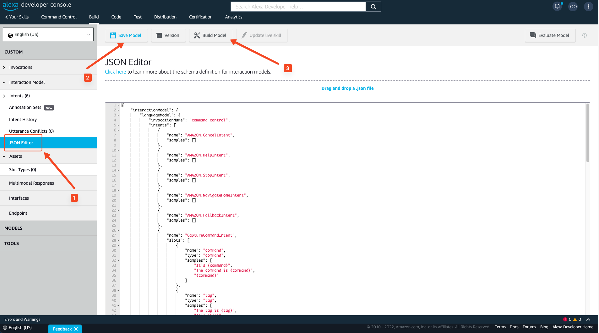

2. Under `CUSTOM` section on the left hand side menu, click on `Endpoint`.
3. Select the `AWS Lambda ARN` option, which is selected by default. Then, copy `Your Skill ID` from the `Endpoint` page. The Skill ID is the unique identifier for the skill. It allows Alexa to identify the skill and to invoke the Lambda function securely. We will need it later.
4. We will come back to this page to add our AlexaSkill Lambda function ARN.


#### Step 3: Configuring Lambda function hosting Alexa skill with Alexa service

1. Navigate back to the AWS Lambda console and select the `AlexaSkill` function.
2. Add an Alexa trigger to the Lambda function as shown below and paste the `Your Skill ID` from the `Endpoint` page. Then, click on the `Add` button.
3. Head back to the Alexa Developer Console and add the AlexaSkill Lambda function ARN to the `Endpoint` page. Then, click on the `Save Endpoints` button. Refer to Step 2, bullet 4. 


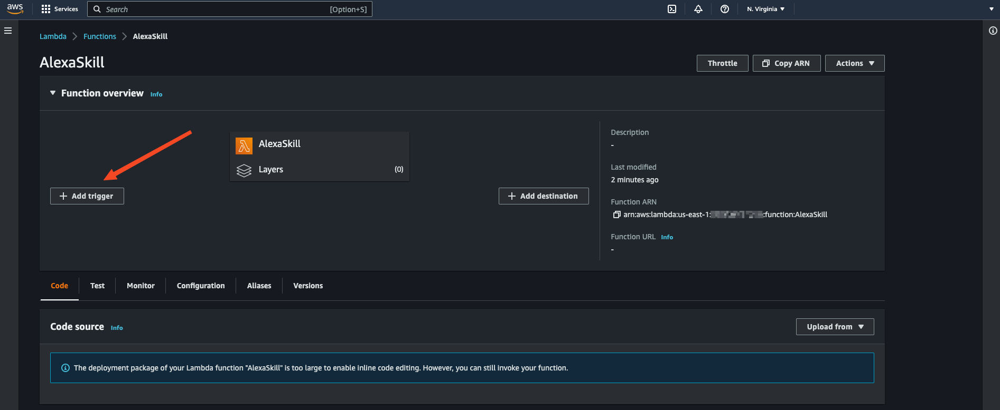
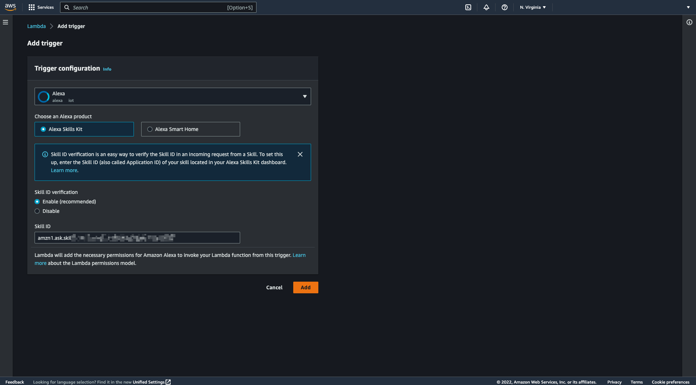

3. Under Configuration, select `Permissions` tab and click on `Role name` link to open the IAM role on a new tab.
4. Create an inline policy to allow the lambda to invoke other lambda functions. Define the policy as shown below:

- Service: Lambda
- Actions: InvokeFunction
- Resources: `arn:aws:lambda:us-east-1:123456789012:function:*` (replace the account number and region with your own)

Or, you can use the following JSON to create the policy:

```
{
    "Version": "2012-10-17",
    "Statement": [
        {
            "Sid": "InvokeLambda",
            "Effect": "Allow",
            "Action": "lambda:InvokeFunction",
            "Resource": "arn:aws:lambda:us-east-1:123456789012:function:*"
        }
    ]
}
```
- Replace the account number and region with your own


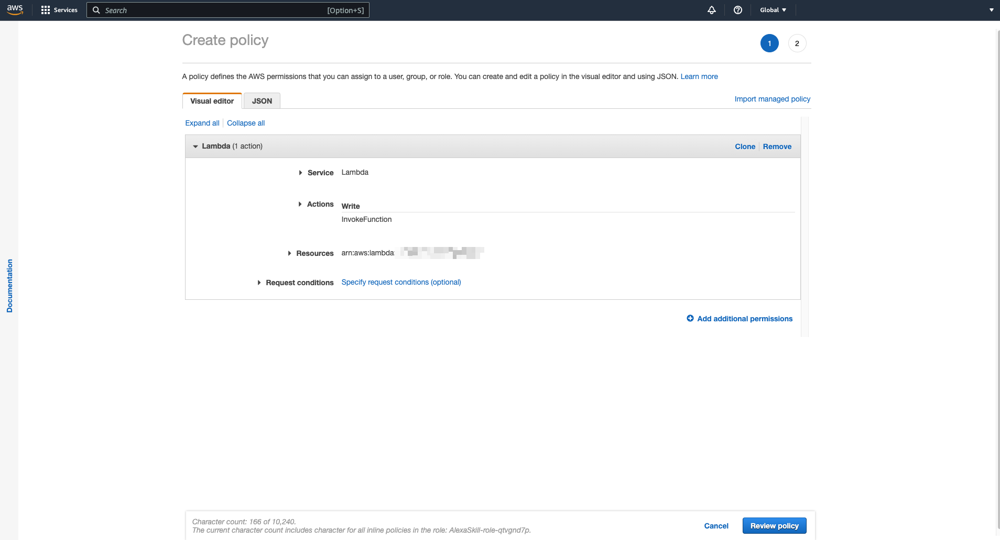

5. Click on the `Review policy` button, give the policy a name and click on the `Create policy` button.


>Note: you may create a customer managed policy and attach it to the role instead of creating an inline policy. Please, refer to [AWS documentation](https://docs.aws.amazon.com/IAM/latest/UserGuide/access_policies_manage-attach-detach.html) for more information.

---


## 3: Creating SSM document to stop EC2 instances

As previously mentioned, we will create our own SSM document to stop EC2 instances, and we will also use an Amazon managed or built-in SSM document to patch Amazon Linux 2 EC2 instances. By following this strategy, we would cover two case scenarios:

- Customer created SSM document
- Amazon managed SSM document

The reasoning behind this is that we may have our own SSM documents to perform certain tasks. Also, we may need to use Amazon managed or built-in SSM documents to perform other tasks. 


#### Step 1: Customer created SSM document:

The below steps are for creating an SSM document to stop Amazon Linux 2 EC2 instances:

1. Navigate to AWS Systems Manager console and select `Documents` from the left hand side menu.
2. Click on the `Create document` button and select `Command or Session` from the drop-down menu.
3. On the `Create document` page, enter the following information:

* Name: `StopEC2Instances`
* Document type: Command document
* Content: YAML
* Content: Copy the YAML text from this [file](files/StopEC2Instances.yaml) and paste it into the `Content` field and click on the `Create document` button.


>Note: the SSM document works on Amazon Linux 2 instances. If you are using a different operating system, you may need to modify the SSM document to work with your operating system.

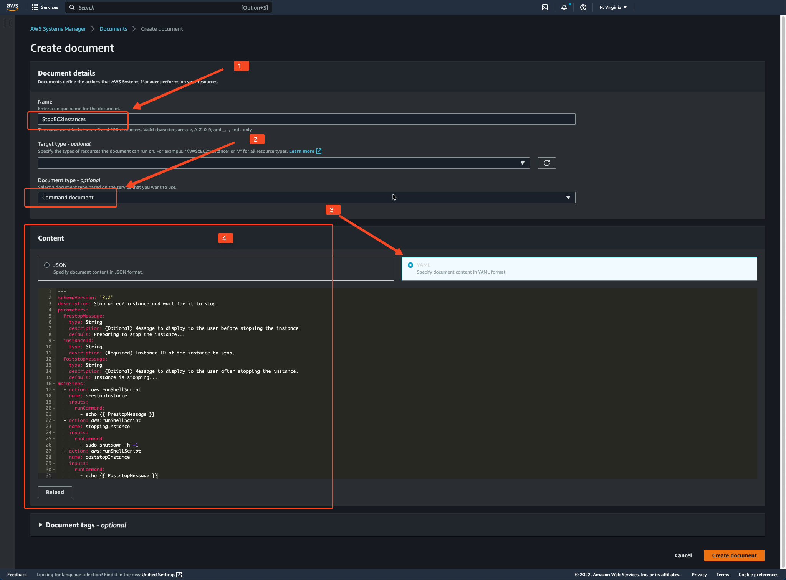

#### Step 2: Amazon managed SSM document:


This step is informational only. The Amazon managed document called [`AWS-RunPatchBaseline`](https://docs.aws.amazon.com/systems-manager/latest/userguide/patch-manager-about-aws-runpatchbaseline.html) is used to patch EC2 instances. It works on all operating systems (Windows, Linux, and macOS). The document requires parameters to be passed to it. The following parameters are some of the parameters that can be passed to the document, but not all of them are required:

* Operation: The operation to perform. Valid values: Scan, Install
* RebootOption: The reboot option for the instances. Valid values: RebootIfNeeded, NoReboot
* Target selection: The instances to patch. Valid values: InstanceIds, Tags
* Timeout(seconds): The maximum time (in seconds) that the command can run before it is considered to have failed. The default value is 3600 seconds.
* Rate control: The maximum number of instances that are allowed to run the command at the same time. You can specify a number of instances, such as 10, or a percentage of instances, such as 10%. The default value is 50.
* Error threshold: The maximum number of errors allowed before the system stops sending the command to additional targets. 
* Output S3 bucket: The S3 bucket where the command execution details are stored.
* SNS topic: The SNS topic where notifications are sent when the command status changes.
* IAM role: The IAM role that allows Systems Manager to send notifications.
* Event notifications: The event notifications that trigger notifications about command status changes.

The following are the parameters that we will pass to the AWS-RunPatchBaseline document via RunDocument:

* Document name: AWS-RunPatchBaseline
* Document version: $LATEST
* Operation: Install
* RebootOption: RebootIfNeeded
* Target selection: Tags
* Timeout(seconds): 3600
* Rate control: 50
* Error threshold: 0
* SNS topic ARN: SSMCommandNotifications
* IAM role ARN: Systems Manager IAM role
* Event notifications: All
* Event notification Type: Command
* Comment: Alexa - AWS-RunPatchBaseline


>Note: we will configure the minimum required parameters to run AWS-RunPatchBaseline document. For more information about these parameters, refer to [AWS documentation](https://docs.aws.amazon.com/systems-manager/latest/userguide/patch-manager-about-aws-runpatchbaseline.html).

---

## 4: Creating SNS topic to receive notifications from Systems Manager - Run Command

1. Navigate to AWS SNS console and click on the `Create topic` button.
2. Enter the following information:

* Type: Standard
* Topic name: `SSMCommandNotifications`
* Display name: `SSMCommandNotifications`
* Click on the `Create topic` button.

3. Capture the `Topic ARN` from the `Topic details` page. We will use this ARN later to add it as environment variable to the lambda function.

>Note: this SNS topic is to receive notifications from Systems Manager - Run Command.

---

## 5: Creating IAM role to allow Systems Manager to send notifications to SNS

This service role is assumed by Systems Manager to publish notifications to the SNS topic when the SSM command status changes. 

#### Step 1: Creating the IAM role:

1. Navigate to AWS IAM console and click on the `Create role` button.
2. Select `AWS service` from the `Select type of trusted entity` drop-down menu. Then, select `Systems Manager` from the `Choose a use case for other AWS services` drop-down menu and select `Systems Manager` again. Click on the `Next: Permissions` button.

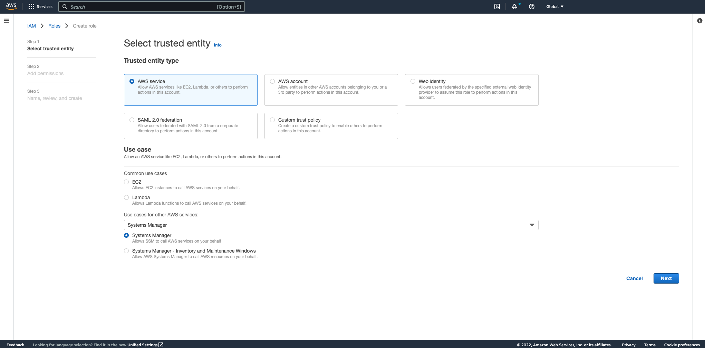

3. Click on the `Next` button on the `Attach permissions` page. We will attach an inline policy to the role in the next step.
4. On the `Name, review and create` page, give the role a name and click on the `Create role` button.

#### Step 2: Attaching inline policy to the IAM role:

1. Navigate to AWS IAM console and select `Roles` from the left hand side menu.
2. Search for the role you created in the previous step and click on the role name.
3. Click on the `Add permissions` button and select `Create inline policy` from the drop-down menu.
4. Click on the `JSON` tab and paste the following JSON body into the `Policy document` field:

```json
{
    "Version": "2012-10-17",
    "Statement": [
        {
            "Sid": "VisualEditor0",
            "Effect": "Allow",
            "Action": "sns:Publish",
            "Resource": "arn:aws:sns:us-east-1:123456789012:SSMCommandNotifications"
        }
    ]
}
```
>Note: replace the region, account ID, and SNS topic name with your own values. Or, you can use `"arn:aws:sns:*:*:*"` to allow the IAM role to send notifications to all SNS topics.

5. Click on the `Review policy` button and give the policy a name. Then, click on the `Create policy` button.
6. Capture the IAM role ARN. We will use this ARN later to add it as environment variable to the lambda function.

---


## 6: Provisioning on-demand DynamoDB table

The DynamoDB table will be used to store the commands, SSM document names and any SSM document parameters that will be used by the Master Lambda function.

#### Step 1: Creating DynamoDB table:

1. Navigate to AWS DynamoDB console and click on the `Create table` button.
2. Enter the following information:

* Table name: `SSMCommands`
* Primary key: `Command` (String)
* Table settings: `Customize settings`
* Table class: `DynamoDB Standard`
* Read/write capacity settings: `On-demand`
* Click on the `Create` button.

3. Capture the table name. We will add the name as as environment variable to the lambda function.


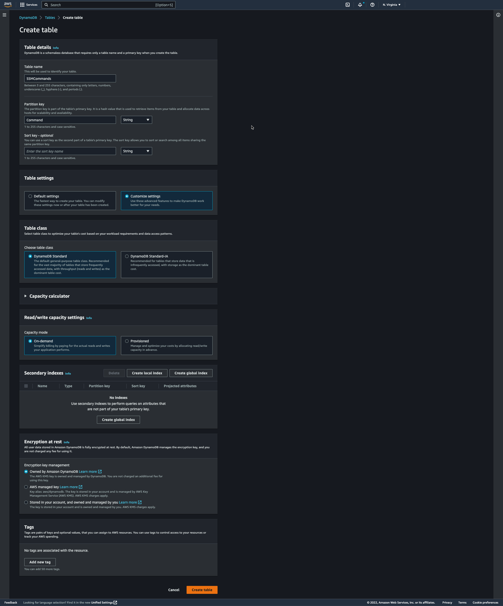


#### Step 2: Creating DynamoDB table items:

1. Navigate to AWS DynamoDB console and select the `SSMCommands` table.
2. Click on the `Actions` button and select `Create item`.
3. For the `Command` value field, enter `shutdown`.

>Note: Alexa service does not support the `stop` command. It is a reserved word. Therefore, we will use the `shutdown` command to stop the EC2 instances. 

4. Click on the `Add new attribute` button and select `String` from the dropdown menu.
5. For the `Attribute name` field, enter `DocumentName` and for the `Value` field, enter `StopEC2Instances`. Click on the `Create item` button.
6. Repeat steps 2-5 and create a new item with the following information:

* Command: `patch`
* DocumentName: `AWS-RunPatchBaseline`

7. Click on the `Add new attribute` button and select `String` from the dropdown menu. For the `Attribute name` field, enter `Parameters` and for the `Value` field, enter the following JSON:

```
{
   "Operation":[
      "Install"
   ],
   "RebootOption":[
      "RebootIfNeeded"
   ]
}
```

8. Click on the `Create item` button.

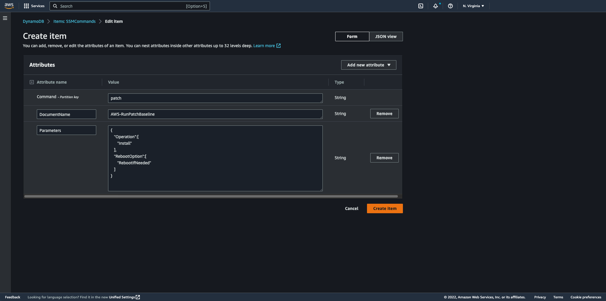
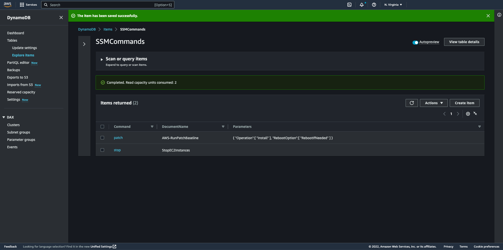

---


## 7: Creating Master Lambda function (MasterLambda) to send SSM commands to Run Command


#### Step 1: Creating Lambda function:

1. Navigate to AWS Lambda console and create a new function with the following settings:

* Function name: `MasterLambda` or any name you prefer
* Runtime: Python 3.9
* Architecture: x86_64
* Role: Create a new role with basic Lambda permissions
* Click Create function

>Note: we will revisit the lambda function IAM role to add all necessary permissions.

2. Copy the Python source code for the [ MasterLambda](files/MasterLambda.py) function and paste it into the `Code source` on the Lambda console. Then, click on the `Deploy` button.
3. Under `Configuration` tab, select `Permissions` and click on `Role name` link to open the IAM role on a new tab.
4. Create inline policy and copy the inline policy from this [JSON file](files/inline_policy.json) and paste it into the JSON editor. Replace the account number with your own. Then, click on the `Review policy` button. Give the policy a name and click on the `Create policy` button. The added policy will allow the lambda function to perform the following actions:


- Service: SSM - Actions: SendCommand, ListCommands, DescribeInstanceInformation
- Service: ec2 - Actions: DescribeInstances
- Service: SNS - Actions: Publish
- Service: DynamoDB - Actions: Query
- Service: IAM - Actions: PassRole


>Note: following AWS best practices and security principles, we are using the least privilege principle to grant the lambda function only the permissions it needs to run and to communicate other AWS services successfully. For more information, refer to [AWS documentation](https://docs.aws.amazon.com/IAM/latest/UserGuide/best-practices.html#grant-least-privilege).


5. Under `Configuration` tab, select `General configuration` and click on `Edit` button. Change the timeout to 30 seconds and click on the `Save` button.

>Note: I have tested 30 seconds timeout and 128 MB memory and they are sufficient for this solution. 

6. Under `Configuration` tab, select `Environment variables` and click on `Edit` button. Add the following environment variables:

* `DynamoDB_Table_Name`: `SSMCommands` (replace the DynamoDB table name from the previous step)
* `SNS_Topic_ARN`: `arn:aws:sns:us-east-1:123456789012:SSMCommandNotifications` (replace the SNS topic ARN from the previous step)
* `SSM_Role_ARN`: `arn:aws:iam::123456789012:role/SSMCommandRole` (replace the IAM role ARN from the previous step)

- The environment variables are used by the Master Lambda function to access the DynamoDB table and to pass on the SNS topic and the IAM role to Systems Manager.

7. Click on the `Save` button.  

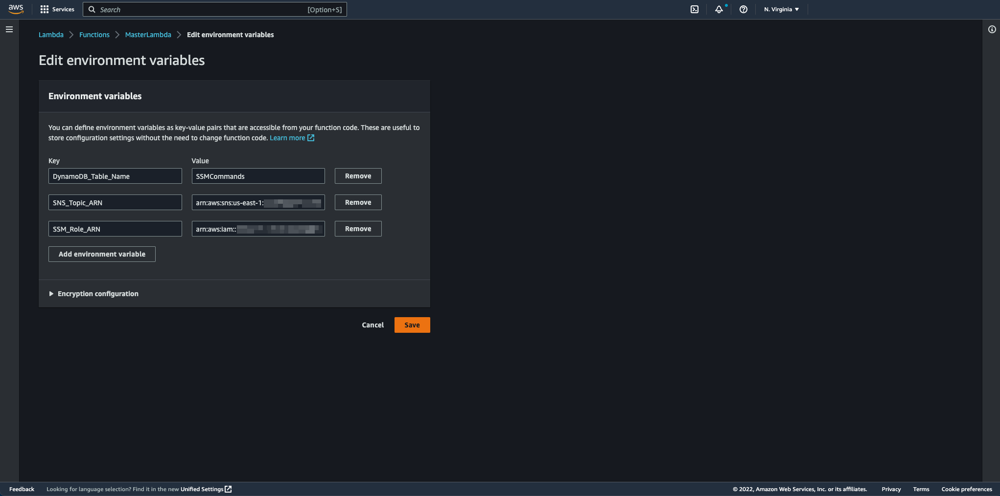

#### Step 2: Configuring communication between MasterLambda function and AlexaSkill Lambda function:

1. Navigate to AWS Lambda console and select the `AlexaSkill` function.
2. Under `Configuration` tab, select `Environment variables` and click on `Edit` button. Add the following environment variables:

* `MasterLambdaARN`: `arn:aws:lambda:us-east-1:123456789012:function:MasterLambda` (replace the ARN with your own value or copy the Master Lambda function ARN from the previous step)

---

## 8: Creating Lambda function (SlackLambda) to send notifications to Slack (Optional)

#### Step 1: Creating Secrets Manager secret to store Slack webhook URL:

The AWS Secrets Manager is used to store the Slack webhook URL. The webhook URL is a unique URL that is used to send messages to a specific Slack channel. For more information about Slack webhooks, refer to [Slack documentation](https://api.slack.com/messaging/webhooks).

1. Navigate to AWS Secrets Manager console and click on the `Store a new secret` button.
2. Enter the following information:

* Secret type: `Other type of secret`
* Key/Value pairs: select `Plaintext` and remove everything from the block.
* Paste the full Slack webhook URL and click on the `Next` button.
* Secret name: `SlackWebhookURL`
* Description: `Slack webhook URL`
* Click on the `Next` button and `Next` again. Then, click on the `Store` button.

>Note: we are using AWS Secrets Manager to store the Slack webhook URL. For more information, refer to [AWS documentation](https://docs.aws.amazon.com/secretsmanager/latest/userguide/intro.html). 

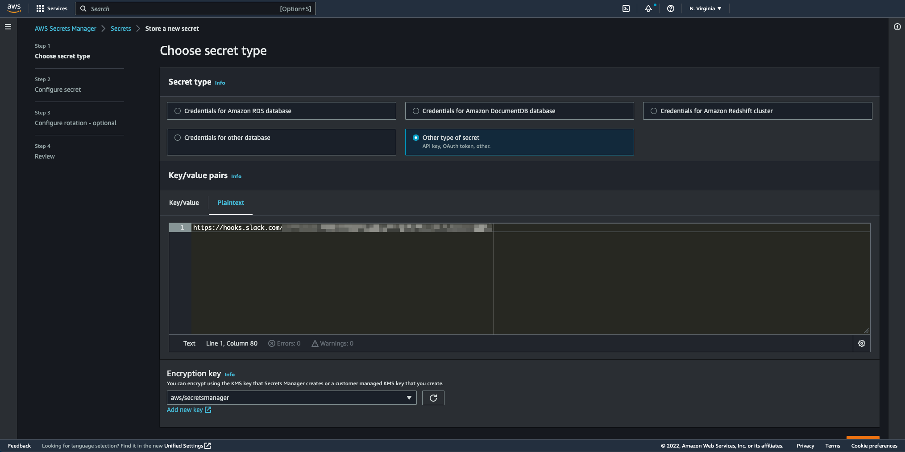

#### Step 2: Creating Slack lambda function:

1. Navigate to AWS Lambda console and create a new function with the following settings:

* Function name: `SlackLambda` or any name you prefer
* Runtime: Python 3.7
* Architecture: x86_64
* Role: Create a new role with basic Lambda permissions
* Click Create function

>Note: I have Python 3.7 as a runtime for this function due to the fact that the `requests` library is supported as part of the AWS Lambda execution environment in Python 3.7 and below. It means that we don't have to create a deployment package. The `request` library is not supported in Python 3.8 and above. For more information, refer to [AWS blog](https://aws.amazon.com/blogs/compute/upcoming-changes-to-the-python-sdk-in-aws-lambda/)


2. Copy the Python code for the [SlackLambda](files/SlackLambda.py) function and paste it into the `Code source` on the Lambda console. Then, click on the `Deploy` button.
3. Under `Configuration` tab, select `Permissions` and click on `Role name` link to open the IAM role on a new tab.
4. Create inline policy and copy the inline policy from this [JSON text](files/SecretsManager.json) and paste it into the JSON editor. Then, click on the ` Review policy` button. Give the policy a name and click on the `Create policy` button. The added policy is to allow the Lambda function to get the Slack webhook URL from Secrets Manager by performing the following action:

* Service: secretsmanager - Actions: GetSecretValue

5. Under `Configuration` tab, select `General configuration` and click on `Edit` button. Change the timeout to `30` seconds and click on the `Save` button.
6. On the `SlackLambda.py` file, make sure to update the `SLACK_CHANNEL` variable with the Slack channel name. Then, click on the `Deploy` button.

* `SLACK_CHANNEL`: the Slack channel name

7. If you are using a different name for the Secrets Manager secret, make sure to update the `SLACK_HOOK_URL` variable with the name of the secret for the Slack URL. Then, click on the `Deploy` button.

* `SLACK_HOOK_URL` = boto3.client('secretsmanager').get_secret_value(SecretId='SlackWebhookURL')['SecretString']

- Replace `SecretId` with your secret name.

#### Step 3: Subscribing SlackLambda function to the SNS topic:

1. From the AWS Lambda console, select the `SlackLambda` function.
2. Under `Function overview`, click on the `Add trigger` button.
3. Select `SNS` and again select `SSMCommandNotifications` topic. Then, click on the `Add` button.

>Note: the `SSMCommandNotifications` topic is the SNS topic that we created in the previous section. If navigate to the SNS console, you will see that the `SlackLambda` function is subscribed to the `SSMCommandNotifications` topic.

---

## 9: Testing Alexa skill solution

Now, we have configured the Alexa skill solution, we are ready to test it. We will spin up two Amazon Linux 2 EC2 instances and then run the `shutdown` command to stop the first instance on Alexa Developer Console simulator. Then, we will run the `patch` command to patch the second instance. However, we need to tag the instances with the key-value pair first. 

| Instance   | Tag Key   | Tag Value   |
| ---------- | --------- | ----------- |
| Instance 1 | `Alexa`   | `testing`   |
| Instance 2 | `Alexa`   | `patching`  |


>Note: the tags are case sensitive. The `A` in Alexa has to be capitalized and `testing` and `patching` have to be lower case. These are the commands and tags that we have defined in the Alexa Service. If you want to use different commands and tags, you will need to update the Alexa Service manually or update the Interaction Model JSON file. 

#### Step 1: Tagging EC2 instances:

During the provisioning of the two EC2 instances, add the above tags to the instances accordingly. Alternatively, you can add the tags to the instances after provisioning them. However, it might take a few minutes for Systems Manager to detect the tags.

How to add tags to the EC2 instances after provisioning them:

1. Navigate to the EC2 console and select the first instance.
2. Click on the `Tags` tab and click on the `Add/Edit tags` button.
3. Add the following tags:

| Key   | Value   |
| ----- | ------- |
| Alexa | testing |

4. Repeat the same steps for the second instance and add the following tags:

| Key   | Value   |
| ----- | ------- |
| Alexa | patching |

>Note: the EC2 instances should be managed by Systems Manager. To confirm that, navigate to the Systems Manager console and under `Node Management`, select `Fleet Manager`. You should see the two instances listed there.

#### Step 2: Testing Alexa skill:

1. Navigate to the Alexa Developer Console and click on the name of the skill, `Command Control`.
2. Click on the `Test` tab and toggle the `Skill testing is enabled in` to `Development`.

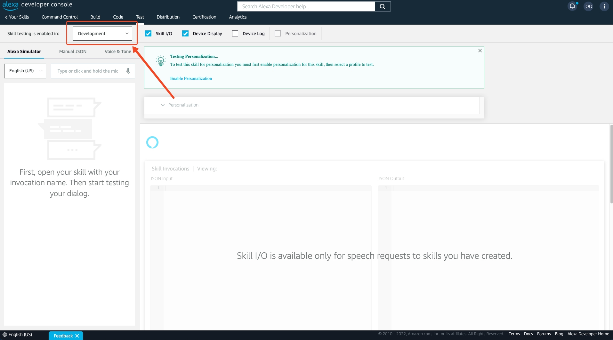

3. Next to the microphone icon, type `open command control` and click on the `Enter` button.
4. Type `shutdown` and `testing` as shown below and click on the `Enter` button.

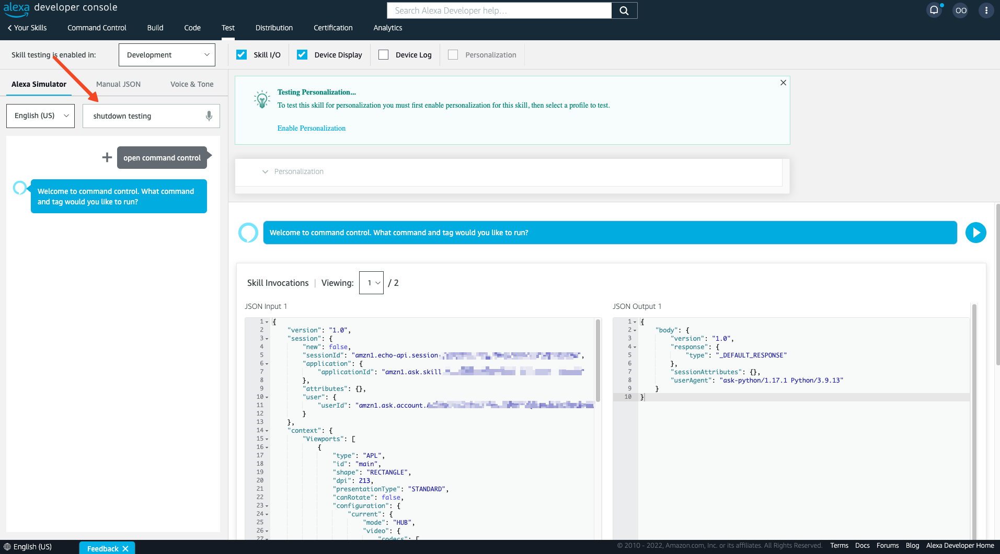


- If you have not tagged the EC2 instance with the key-value pair `Alexa` and `testing`, the instance is not running or the instance is not managed by Systems Manager, you will get the following error message:

```
I couldn't find any running instances tagged with testing. You can run a different command or say cancel to exit.
```

- If you have tagged the EC2 instance with the key-value pair `Alexa` and `testing`, the instance is running and the instance is managed by Systems Manager, you will get the following message:

```
I have sent command shutdown to 1 instance tagged with testing and its current status is Pending. You will receive a Slack notification when the command starts and completes.
```
<br>

**Example:**

- I had not tagged the EC2 instance with the key-value pair `Alexa` and `testing` and received a message by Alexa stating that there is no running instance tagged with `testing`. 
- Then, I tagged the EC2 instance with the key-value pair `Alexa` and `testing` and waited for a few minutes for Systems Manager to detect the tags. 
- Then, I ran the `shutdown` command and received a message by Alexa stating that the command has been sent to the instance. It takes the instance one minute to shutdown according to our `StopEC2Instances` SSM document as per design. 
- I also received a Slack notification stating that the command has been sent to the instance and the command status is `InProgress` and then `Success` when the command completed.

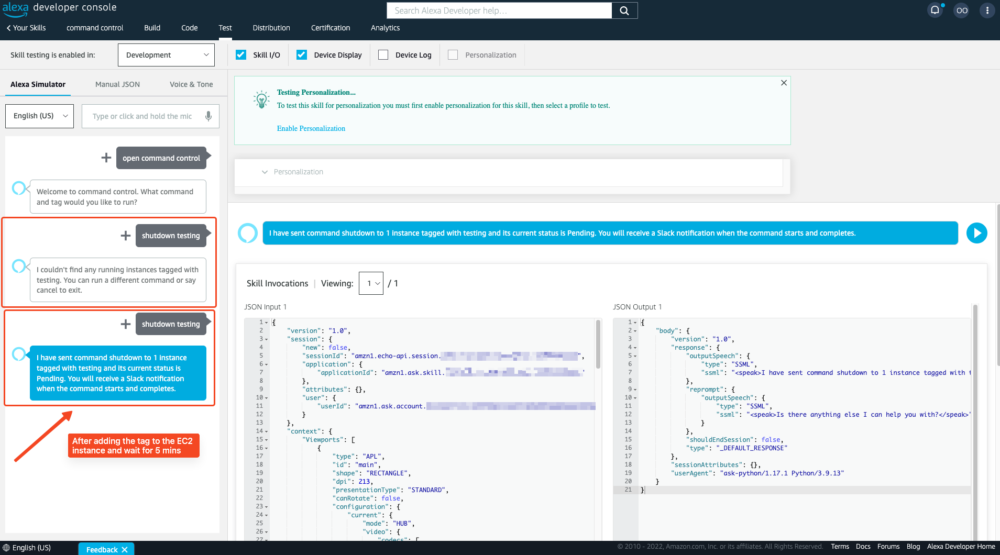

5. Now, let's run the `patch` command to patch the second instance. Type `patch` and `patching` and click enter. Since we have spun up the instance recently, there are no patches to install and it would not take long to complete the patching. AWS is doing a great job in keeping the Amazon Linux 2 up to date. We can follow the command status or history in the Systems Manager console. We should receive Slack notifications when the command starts and completes, if we have configured SlackLambda function and Slack webhook URL correctly.

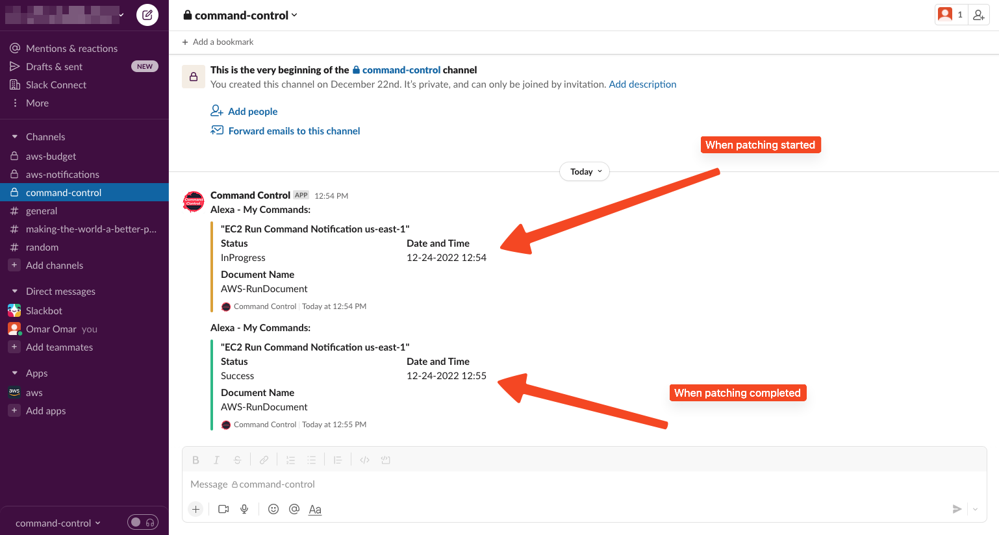


**Important Notes**

- If the simulator sits idle for 5 minutes or so, it will time out and you will need to refresh the page and start over.
- To troubleshoot any issues, you can check the CloudWatch logs for the `MasterLambda` and `AlexaSkills` Lambda functions.
- You can also check the Systems Manager console to see the command status and the command output by going to the `Run Command` section and selecting the `Command history`.
- You can enable `Your Skills` in development mode on Alexa app on your mobile phone and test the skill on your mobile phone.

---

## Conclusion

Congratulations on completing this tutorial! We have learned how to build a complete Alexa skill solution that can run SSM documents on SSM managed EC2 instances. The journey started with creating an Alexa skill hosted on an AWS Lambda function. Then we created a Master Lambda function that is triggered by the Alexa skill Lambda function. The Master Lambda function calls Systems Manager API using Boto3 SDK for Python to run SSM documents on SSM managed EC2 instances. We also created a Slack Lambda function that is subscribed to an SNS topic to send neat Slack notifications when the SSM command starts and completes. We have also learned how to use the Alexa Developer Console to test the Alexa skill.

Yes, it's time to celebrate! 🎉🎉🎉 

While you are celebrating, you can also think about how you can extend or improve this solution. Maybe you can add more SSM documents and more Alexa commands, or maybe you can learn more about Alexa utterances and intents. How about we take this solution to the next level and build an Observability solution? Maybe we can use the Alexa service with Grafana or CloudWatch to monitor metrics of our environments. That's another tutorial for another day :wink:

The possibilities are endless and learning is a lifelong journey. Innovation is the key to success, so keep learning and keep innovating!

```
Omar A Omar
Site Reliability Engineer
San Antonio, TX
```

---


## References

* [Alexa Skills Kit - Tutorials](https://developer.amazon.com/de-DE/alexa/alexa-skills-kit/tutorials)
* [Alexa Skills Kit SDK for Python](https://developer.amazon.com/en-US/docs/alexa/alexa-skills-kit-sdk-for-python/overview.html)
* [AWS Lambda](https://aws.amazon.com/lambda/)
* [AWS Systems Manager](https://aws.amazon.com/systems-manager/)
* [AWS IAM](https://aws.amazon.com/iam/)
* [AWS S3](https://aws.amazon.com/s3/)


---
